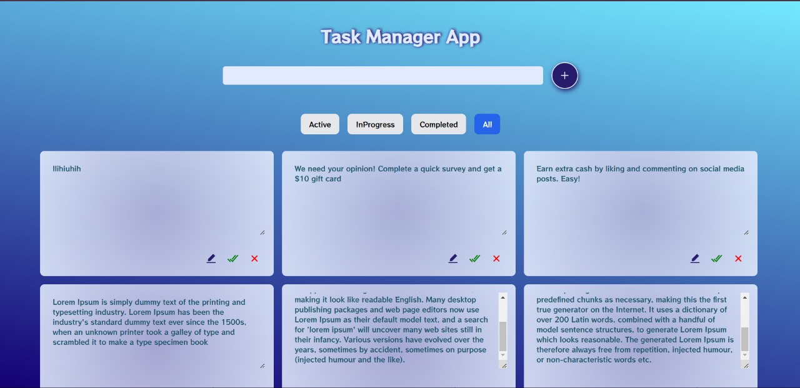

# React + Vite

This template provides a minimal setup to get React working in Vite with HMR and some ESLint rules.

Currently, two official plugins are available:

- [@vitejs/plugin-react](https://github.com/vitejs/vite-plugin-react/blob/main/packages/plugin-react/README.md) uses [Babel](https://babeljs.io/) for Fast Refresh
- [@vitejs/plugin-react-swc](https://github.com/vitejs/vite-plugin-react-swc) uses [SWC](https://swc.rs/) for Fast Refresh


# 📝 Task Manager App  

A simple and efficient **Task Manager App** built using **ReactJS, Redux, and Framer Motion**. This app allows you to **add, edit, update, delete, and track** your tasks with a progress monitoring feature. The tasks are stored in **localStorage**, ensuring persistence across page reloads.  

## 🚀 Features  
- ✅ **Add, Edit, Update, and Delete** tasks.  
- 🔄 **Track Progress** (Active, In Progress, Completed).  
- 💾 **LocalStorage Integration** (Tasks persist even after page refresh).  
- 🎨 **Smooth Animations** with Framer Motion.  
- ⚡ **State Management** using Redux.  

## 🛠️ Technologies Used  
- **ReactJS** - Frontend UI  
- **Redux** - State Management  
- **Framer Motion** - Animations  
- **LocalStorage** - Data Persistence  

## 📸 Screenshots  


## 📦 Installation & Usage  
### 1️⃣ Clone the Repository  
```
git clone https://github.com/manojkumar2291/task.git
cd task-manager-app
```
2️⃣ Install Dependencies
```

npm install
```
3️⃣ Run the App
```

npm start
```
This will start the app at http://localhost:3000/

🤝 Contributing
Contributions are welcome! Feel free to fork, open an issue, or submit a pull request.

📄 License
This project is open-source under the MIT License.

